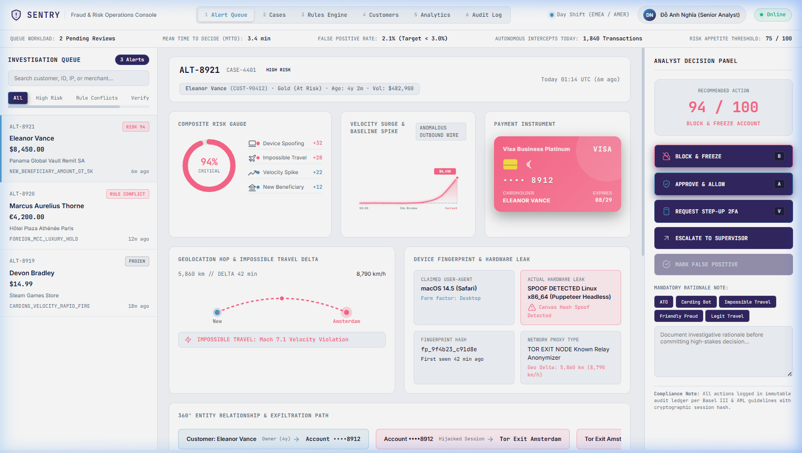

# SENTRY — Fraud & Risk Operations Console

> **Flagship Fintech Case Study**: An institutional internal tooling console designed for high-stakes fraud investigation, evidence correlation, and rapid decisioning without context-switching across disparate banking systems.



---

## 01. The Problem & Product Core

In high-volume banking and fintech environments, fraud analysts are tasked with making high-stakes, irreversible decisions: **block or allow**. 

Traditional risk workflows force analysts to swivel between 4–6 siloed interfaces—a payment gateway, identity KYC vault, device telemetry portal, proxy detection database, and internal core banking ledger. This fragmented context inflates **Mean Time to Decide (MTTD)**, causes customer friction through false positives, and enables sophisticated fraudsters (Account Takeover, carding bots, synthetic identities) to slip through.

**SENTRY** solves this through a **Split Investigation Workspace**:
```
[ Alert Queue (Left Rail) | Forensic Evidence Workspace (Center) | High-Stakes Decision Dock (Right) ]
```
Every piece of behavioral, network, device, and historical counterparty evidence is unified on a single screen, allowing analysts to triage and resolve an alert in seconds.

---

## 02. Information Architecture (IA)

```
SENTRY Console
├── Risk Overview / Alert Queue (Hero Split Workspace)
│   └── Alert Detail
│       ├── Transaction & Velocity Telemetry
│       ├── Customer Profile & Trust Tier
│       ├── Device Fingerprint & Canvas Authenticity
│       ├── Network, Geolocation Hop & Anonymizers
│       ├── Beneficiary Counterparty & Watchlist
│       ├── Triggered Rules & Rule Conflict Detector
│       └── Decision Dock
├── Cases (Case Assignment, SLA Countdown Timers)
├── Rules Engine (Velocity Limits, Rule Conflict Precedence)
├── Customers (360° Identity Risk Directory)
├── Analytics (Losses Prevented, False Positive Rate, MTTD)
└── Audit Log (Immutable Forensic Decision Ledger)
```

---

## 03. Visual Direction & Signatures (Visual-First Architecture)

- **Visual Direction**: High-density Clinical Light Theme (Canvas: `#F4F6FA`, Surfaces: `#FFFFFF`, Action Buttons & Brand Mark: `#322761`, Primary Dark Text: `#141527`, Visual Accents & Payment Cards: `#4496C8` & `#FE678A`) with a universal stroke-based minimalist line-art SVG icon system (`SentryIcons`). Clinical, institutional, zero emojis.
- **Visual Telemetry & Diagram Cards**:
  1. **Radial Donut Risk Gauge**: Circular SVG donut ring (`94% CRITICAL`, `62% REVIEW`) with animated stroke-dashoffset, dynamic categorical point breakdowns (+32 Device, +28 Travel, +22 Velocity, +12 Beneficiary).
  2. **Spend Velocity Spline Wave Chart**: Smooth cubic Bezier spline with gradient area fill, baseline normal curve, and glowing anomaly peak tag (`$8,450`, `€4,200`).
  3. **Virtual / Physical Payment Instrument**: Realistic glassmorphic debit card widget (gradient skins, gold EMV chip, contactless wave icon, cardholder name, masked PAN, expiry date).
  4. **Geolocation Flight Hop Diagram**: Parabolic flight arc between origin and destination with distance (`5,860 km`), time delta (`42 min`), velocity (`8,790 km/h`), and impossible travel warning.
  5. **Device Fingerprint & Hardware Leak Dissector**: Side-by-side comparison of claimed user-agent vs actual hardware leak with Canvas Spoof Detection badges.
  6. **360° Entity Relationship Flow Graph**: Interactive node-to-node transaction and exfiltration path diagram.
  7. **Evidence Trace & Policy Rules**: Chronological timeline comparing account history against recent anomalies, plus real-time Rule Conflict detection (Rule 301 vs Rule 012 VIP Exemption).
- **State Handling**:
  - `HIGH_RISK` (Critical composite score > 75, immediate freeze recommendation).
  - `RULE_CONFLICT` (System conflict detected, e.g. Rule 301 Foreign Luxury Hold vs Rule 012 VIP Exemption, requiring manual analyst precedence).
  - `NEEDS_VERIFICATION` (Biometric / Step-up 2FA out-of-band challenge).
  - `FROZEN` (Air-gapped and locked outbound account rails).
  - `RESOLVED / ALLOWED` (Clean baseline, false positive cleared).

---

## 04. Required Decision Flow

1. **Alert Selection**: Analyst selects pending item from the prioritized Left Queue.
2. **Evidence Inspection**: Center workspace correlates transaction velocity, device canvas hash, proxy ASN, and beneficiary FATF jurisdiction.
3. **History Comparison**: Evidence Trace compares current event with 3-month baseline behavior.
4. **Action Execution**: Analyst selects tactile action (`Block & Freeze`, `Approve & Allow`, `Step-Up 2FA`, `Escalate`, `False Positive`).
5. **Mandatory Rationale**: Analyst applies categorical tags (`[ATO]`, `[Carding Bot]`, `[Impossible Travel]`) and notes justification for compliance.
6. **Resolution & Auto-Advance**: Action is committed to the immutable Audit Log, counters update, and workspace smoothly auto-advances to the next priority alert.

---

## 05. Benchmark References

- **Stripe Radar**: Machine learning risk scoring, rule velocity checks, and frictionless review queues.
- **Adyen Risk Management**: Custom scoring lists and cross-merchant behavioral intelligence.
- **Sift & Sardine**: Device fingerprinting, proxy detection, and instant bank wire dispute mitigation.
- **Alloy & Persona**: 360° customer identity graphs and KYC step-up workflows.

---

## 06. Tech Stack & Local Setup

Built with framework-free modern web standards:
- **Semantic HTML5**: Dense, accessible data structures.
- **Custom CSS3 Design Tokens**: Clinical institutional light and dark themes, hairline surgical borders, tabular monospace alignment.
- **Vanilla ES6+ JavaScript**: Dynamic queue filtering, risk spectrum calculations, rule conflict resolution, and local state management.

```bash
# Clone the repository
git clone https://github.com/Ngh1aa/Sentry.git
cd Sentry

# Serve locally
python -m http.server 4199
```

Open `http://localhost:4199` in your browser.

---

## 07. Author & Portfolio

Designed & engineered by **Đỗ Anh Nghĩa** as a flagship Fintech UI/UX case study.
All rights reserved © 2026.
